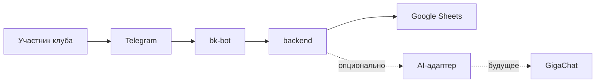

# Архитектура

## Общая схема

## Границы компонентов

### `bk-bot`

Принимает сообщения и нажатия кнопок, показывает ответы и переводит Telegram-события во внутренние запросы. Здесь не должна жить сложная бизнес-логика или прямое чтение таблиц.

### `backend`

Хранит правила продукта: проверки, сценарии, права, обработку ошибок и внутренние модели данных. Backend не должен знать детали Telegram-интерфейса.

### `integrations/google-sheets`

Единственное место, которое знает структуру Google Sheets, имена вкладок и преобразование строк таблицы во внутренние данные. Это обязательная интеграция первого этапа.

### `integrations/ai`

Единый необязательный интерфейс для AI-провайдеров. Сбой или отсутствие GigaChat не должны ломать основные сценарии бота.

## Основные принципы

- Компоненты общаются через понятные входные и выходные данные.
- Telegram, таблицы и AI не смешиваются с бизнес-правилами.
- Любой внешний запрос имеет таймаут и понятную обработку ошибки.
- Персональные данные собираются только при обоснованной необходимости.
- Сначала создаётся простое работающее решение, затем усложняется по измеримой потребности.

## Решения, которые ещё нужно принять

- язык и фреймворк;
- формат запуска бота: polling или webhook;
- хостинг и окружения;
- схема таблиц и идентификаторы сущностей;
- логирование, мониторинг и резервное копирование;
- политика обработки персональных данных.

Каждое существенное решение фиксируется отдельной Issue и обновлением этого документа.
